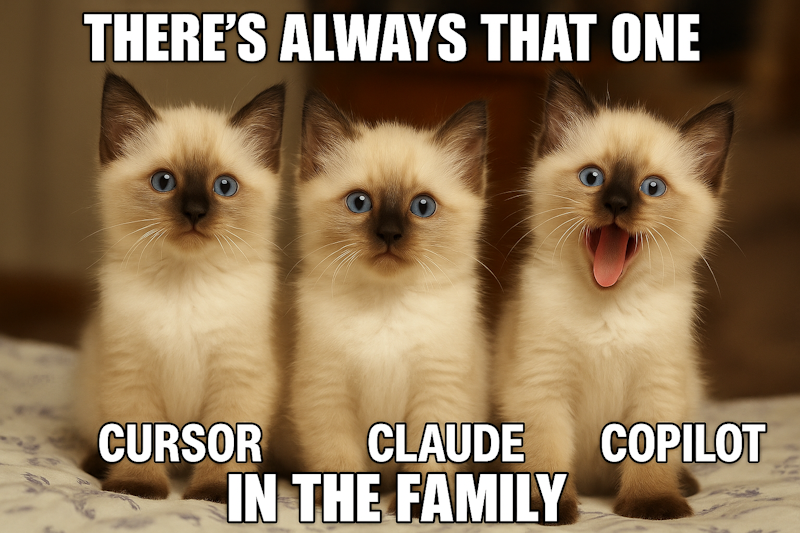

<!-- _class: lead -->

# 🎄 AI-Driven Development Workflow 🎄

**En praktisk guide för att bli grym tillsammans med AI**
_(utan att bli Grinchen som stal julafton)_

Marcus Ackre Medina
YH Campus Mölndal
2024-12-15 ☃️

---

## Vem är jag?

**Marcus Ackre Medina**

- Programmeringslärare @ Campus Mölndal
- 25+ år som systemutvecklare
- Började med en ZX-81
- Älskar ren kod, TDD, och att bygga rätt från början
- Gillar Star Wars, Skräckfilmer och sliskiga Hallmark julfilmer

**Idag pratar vi inte om verktyg.**
**Vi pratar om hur ni använder det ni lärde er igår.**

---

<!-- _class: lead -->

# 0. Intro

_5 minuter - jag lovar att hålla tiden_ ⏰

---

## Vad ni fått hittills (dagens julklappar)

🎁 **Oscar** gav er verktygen (Cursor, Agents, smart prompting)
🎁 **Andrija** lärde er tänka om värde (hållbarhet, integritet, långsiktigt)

**Nu:** Jag ger er workflow-strukturen

> "Oscar visade er motorsågen. Andrija lärde er att inte såga av benet.
> Jag visar hur man bygger möbler (som inte kollapsar)." 🪑

---

## Varför är vi här? (förutom kaffet)

Ni har kört hårt hela helgen:

- ✅ Lärt er verktyg
- ✅ Förstått värde & integritet
- ✅ Byggt grejer

**Men** - hur många har:

- Frågat AI samma sak 5 gånger? 🙋
- Fått kod som "funkar" men känns rörig? 🙋
- Fastnat för att projektet blev för stort? 🙋

**Dagens mål: Fixa det. För gott.**

---

## Min tes

> **Det är workflow, inte verktyg, som avgör hur långt du kommer.**

Lovable är bra. V0 är bra. <br>
Cursor är bra. Claude är bra. ChatGPT är bra.

---
## Men...

Copilot suger.


---

**Men det är strukturen som gör skillnaden mellan:**

- "Fick det att funka" vs "Byggde något maintainbart"
- "En feature" vs "Ett hållbart system"

**Ni lärde er värdera igår - nu bygger vi det värdet strukturerat.**

---

<!-- _class: lead -->

# 1. Problemet

_3 minuter_

---

## Vad händer ofta?

🔄 Hoppar mellan AI-verktyg utan struktur
📦 Projekten blir för stora direkt
🏗️ Svårt att veta när något är "klart"
🤔 Osäkerhet kring kodkvalitet
🔒 Glömmer säkerhet & integritet

**Resultat:** Kod som funkar, men inte hållbar.

---

## Här är grejen

> **AI är en förstärkare.**

Den förstärker **bra arbetssätt**.
Men den förstärker också **dåliga**.

**Strukturerat arbete** → Snabbt OCH hållbart ✅
**Ad-hoc arbete** → Snabbt men teknisk skuld ⚠️

**Vi ska göra det strukturerat. Idag.**

---

>If you fail to plan, you plan to fail
>
> _- Taylor Swift_

---

<!-- _class: lead -->

# 2. AI som juniorer

## Du som arkitekt

_8 minuter_

---


---
## Mindset-skiftet

<div class="columns">

**Gammalt tänk**

```
Jag
 ↓
AI (expert)
 ↓
"Bygg åt mig"
```

**Nytt tänk**

```
Jag (arkitekt)
 ↓
AI (junior team)
 ↓
"Ge mig alternativ"
```

</div>

**DU äger besluten. DU äger kvaliteten. DU äger datan.**
_(Ni äger värdet, inte AI-plattformen)_

---

## Tre sanningar

### 1. AI producerar flera lösningar - DU väljer

**Baserat på värde & hållbarhet**

```
Prompt: "Ge mig tre sätt att hantera användardata:
1. Enklast möjliga
2. Balanserad (säker & maintainbar)
3. Enterprise (kanske overkill?)

VIKTIGT: Vi planerar nu, inget kodande än.
Bara brainstorming och arkitektur-förslag.

Förklara trade-offs för:
- Säkerhet
- Performance
- Maintainbarhet"
```

---

## Tre sanningar (forts.)

### 2. AI kan skriva kod - DU formar systemet

| AI:s styrka    | Din styrka           |
| -------------- | -------------------- |
| Syntax         | Arkitektur           |
| Boilerplate    | Design decisions     |
| Implementation | Direction            |
| Speed          | Quality & Integritet |

**Verktygen ni lärde er igår - NU styr NI dem.**

---

## Tre sanningar (forts.)

### 3. Du är den som behövs

> **AI kan göra dig 10x snabbare.** > **Men bara om du vet:**
>
> - **VAD** ska byggas (värde)
> - **VARFÖR** det ska byggas så (hållbarhet)
> - **NÄR** något är tillräckligt bra (kvalitet)

**Arkitektur, säkerhet, etik → därför behövs du alltid**

---

<!-- _class: lead -->

# 3. The AI-Driven Dev Loop

_(Med backlog & vertical slices)_

_12 minuter_

---

## De 7 stegen - FÖRTYDLIGAT

```
1. Förtydliga & Spec (DU - 2 min)
    ↓
2. Backlog & Vertical Slices (AI hjälper - 3 min)
    ↓
3. Arkitektur (AI föreslår, DU väljer - 3 min)
    ↓
4. TDD - Tester + Implementation (AI skriver båda - 5 min)
    ↓
5. Manuell test (DU testar - 3 min)
    ↓
6. Refaktorera (AI granskar, DU beslutar - 3 min)
    ↓
7. Commit (DU commitar - 2 min)
```

**Total: ~20 min per slice. Repeterbart.**

**OBS:** Vi hoppar över red-fasen - AI skriver tester + kod direkt

---

## Steg 1: Förtydliga & Spec

**DU gör (ingen AI än):**

Skriv problemet i **1 mening:**
❌ "Jag vill ha en todo-app"
✅ "Användare ska kunna skapa och filtrera todos"

Skriv **minimispec:**

```
Problem: Todo-hantering
Input: Todo text från användare
Output: Sparad todo synlig i lista
Edge cases:
  - Tom text → visa felmeddelande
  - Duplicat titel → tillåtet
  - Persondata? → nej (säkerhetsfråga!)
```

**2 minuter. Klarhet först. Kod sen.**

---

## Steg 2: Backlog & Vertical Slices

**DU + AI (PLANERING - inget kodande än):**

```
Prompt: "Jag vill bygga todo-hantering.

VIKTIGT: Vi planerar nu, inget kodande än.
Bara brainstorming och nedbrytning.

Bryt ner i vertical slices där varje slice:
- Är en KOMPLETT user journey (end-to-end)
- Ger värde separat
- Kan byggas på 15-25 minuter
- Är testbar och deploybar
- Respekterar dataintegritet

Ge mig de 3 viktigaste slicesen först, prioriterade efter värde."
```

---

## Steg 2 (forts.) - AI svarar:

**Exempel-svar från AI:**

```
Vertical Slices för Todo-hantering:

1. Skapa todo (Högst värde)
   - Input från användare → Validera → Spara → Visa
   - End-to-end: UI → Service → Storage → UI

2. Visa todos (Näst viktigast)
   - Hämta från storage → Rendera lista

3. Filtrera todos
   - Välj filter → Filtrera → Visa resultat

4. Ta bort todo
   - Välj → Bekräfta → Ta bort → Uppdatera UI
```

**DU väljer:** "Vi börjar med slice 1 - Skapa todo"

---

## Varför Vertical Slices?

**Slices LEVERERAR värde:**

❌ **Horisontellt:** Bygg hela UI → Sen hela backend → Sen hela DB

- Inget fungerar förrän allt är klart
- Inget värde förrän slutet
- Risk: Bygg fel grejer

✅ **Vertikalt:** En slice = en fungerande feature

- Deploybar efter varje slice
- Användare kan testa direkt
- Feedback tidigt

**Verktyg + Värdetänk + Slices = Leverans**

---

## Steg 3: Arkitektur & Approach

**DU + AI (fortfarande PLANERING):**

```
Prompt: "För slice 1 (Skapa todo):

VIKTIGT: Vi planerar arkitektur nu, inget kodande än.
Bara jämföra approaches.

Ge mig TRE arkitektur-approaches:
1. Enklast möjliga (prototyp)
2. Balanserad (production-ready, säker)
3. Enterprise (fullt utbyggd)

För varje approach, förklara:
- Komplexitet
- Säkerhet (validering, sanitering)
- Performance
- Maintainbarhet
- Trade-offs

Rekommendera baserat på: litet team, MVP-fas, dataintegritet viktigt."
```

---

## Steg 3 (forts.) - AI svarar:

**Exempel:**

**Approach 1 - Enklast:**

```csharp
todos.Add(new Todo(title)); // Ingen validering
```

Pro: Snabbt. Con: Osäkert, ingen null-check

**Approach 2 - Balanserad:** ✅ **VÄLJ DENNA**

```csharp
if (string.IsNullOrWhiteSpace(title))
    throw new ArgumentException("Title required");
if (title.Length > 200)
    throw new ArgumentException("Title too long");

var todo = new Todo(title.Trim());
```

Pro: Säker, maintainbar. Con: Lite mer kod

**DU beslutar: "Approach 2 - vi prioriterar säkerhet"**

---

## Steg 4: TDD - En prompt för allt

**AI skriver (NU börjar kodningen - planeringen är klar):**

```
Prompt: "Implementera slice 1 (Skapa todo) med TDD enligt approach 2.

NU KODAR VI (planeringen är klar).

Skriv tester + implementation i ett svep:

Tester för CreateTodo():
- Normal case: Giltig titel → todo skapas
- Edge: Tom titel → ArgumentException
- Edge: Null titel → ArgumentException
- Edge: Titel för lång (>200 tecken) → ArgumentException
- Edge: Whitespace runt titel → trimmas
- Säkerhet: XSS-attempt i titel → saniteras

Skriv testerna OCH implementationen. Alla tester ska bli gröna."
```

**OBS:** Vi hoppar över red-fasen - AI skriver båda delarna direkt.

---

## Steg 4 (forts.) - AI levererar

```csharp
// AI skriver tester
[Fact]
public void CreateTodo_WithValidTitle_CreatesTodo()
{
    var result = service.CreateTodo("Buy milk");
    Assert.NotNull(result);
    Assert.Equal("Buy milk", result.Title);
}

[Fact]
public void CreateTodo_WithEmptyTitle_ThrowsException()
{
    Assert.Throws<ArgumentException>(
        () => service.CreateTodo("")
    );
}

// ... 4 fler tester
```

**DU kör:** `dotnet test` → ❌ **6 failed** (förväntat! Koden finns inte än)

---

## Steg 5: Manuell testning

**DU kör testerna:**

```bash
dotnet test
```

→ ✅ **6 passed** (AI skrev både tester OCH implementation)

**Magi? Nej. Struktur.** 🎯


---

**Sedan testar DU manuellt:**

Varför manuellt när TDD funkar?

- **TDD täcker:** Logik, edge cases, units
- **TDD täcker INTE:** UX, integration, rendering, user flow

**Du testar:**

```bash
./app create "Buy milk"
# → Ser du todo:n i UI?
# → Sparas den i DB?
# → Funkar undo?
```

**Om fail:** Tillbaka till steg 4. Fixa. Repetera.

---

## Steg 6: Refaktorera (Blå fas)

**När allt funkar → refaktorera:**

```
Prompt: "Granska CreateTodo() mot:

- SRP: Gör metoden EN sak?
- DRY: Finns upprepad logik?
- KISS: Kan det förenklas?
- Säkerhet: Finns sårbarheter?
- Läsbarhet: Förstår nästa person?

Föreslå förbättringar."
```

AI föreslår → DU beslutar → Refaktorera → **Kör tester igen** → ✅ Fortfarande grönt

---

## Steg 7: Commit

**När allt är grönt och refactored:**

```bash
git add .
git commit -m "Add CreateTodo with validation

- Input validation (null, empty, length)
- XSS sanitization for security
- Full TDD coverage (6 tests)
- Vertical slice 1 complete

Addresses dataintegritet & hållbarhet.

🤖 Generated with Claude Code"
```

**Små commits. Ofta. Med kontext.**

---

## Loop:en i praktiken

**Slice 1 klar! (Skapa todo)**

Nu:

- Tillbaka till **steg 2** → Välj nästa slice (Visa todos)
- Hoppa över steg 1 (problemet är redan tydligt)
- Börja vid **steg 3** (arkitektur för visa todos)

**Varje slice = 25 min → Deploybar → Värde levererat**

**Efter 5 slices = Fungerande produkt**

_(Hållbarhetstänk: Leverera värde kontinuerligt, inte big bang)_

---

<!-- _class: lead -->

# 4. Demo - TodoFilter LIVE

_(Jag bygger slice: "Filtrera todos")_

_15 minuter_

---

## Vad vi ska bygga

**Slice: Filtrera todos efter status**

Vi kör hela loopen live - ALLA 7 stegen:

1. Förtydliga & Spec
2. Backlog & Vertical Slices
3. Arkitektur
4. TDD - Tester + Implementation
5. Manuell test
6. Refaktorera
7. Commit

**Ni ser PROCESSEN, inte magin.**

---

## Demo-flöde (följ med!)

**Steg 1: Förtydliga & Spec** (1 min)

```
Problem: Användare vill filtrera todos efter status
Input: Lista av todos + status-sträng ("done", "pending")
Output: Filtrerad lista med matchande todos
Edge cases:
  - Tom lista → returnera tom lista
  - Null input → returnera tom lista
  - Case-insensitive ("Done" = "done")
```

→ Tydligt. Kan förklara på 1 minut. ✅

---

## Demo (forts.)

**Steg 2: Backlog & Vertical Slices** (2 min)

```
Prompt: "Bryt ner TodoFilter i vertical slices.

VIKTIGT: Vi planerar nu, inget kodande än.

Varje slice = komplett user journey, deploybar, ger värde."
```

→ AI föreslår:
1. **FilterByStatus** (viktigast - dagens demo!)
2. FilterByDateAfter
3. FilterByTitleContains

→ Jag väljer slice 1. Resten = backlog.

---

## Demo (forts.)

**Steg 3: Arkitektur** (3 min)

```
Prompt till Claude Code:
"Ge mig tre sätt att implementera TodoFilter.FilterByStatus():
1. Enklast möjliga (prototyp)
2. Balanserad (production-ready, säker)
3. Enterprise (fullt utbyggd)

VIKTIGT: Vi planerar arkitektur nu, inget kodande än.

För varje approach, förklara:
- Komplexitet
- Säkerhet (validering, sanitering)
- Performance
- Maintainbarhet
- Trade-offs

Rekommendera baserat på: litet team, MVP-fas."
```

→ Väljer approach 2 (balanserad)

---

## Demo (forts.)

**Steg 4: TDD** (5 min)

```
Prompt: "Implementera FilterByStatus med TDD.

NU KODAR VI (planeringen är klar).

Skriv tester + implementation i ett svep:
- Normal case: Filter 'done' → returns done todos
- Edge: Tom lista → returnerar tom lista
- Edge: Null input → returnerar tom lista
- Edge: Case-insensitive ('Done' = 'done')

Skriv testerna OCH implementationen. Alla tester ska bli gröna."
```

→ AI skriver både tester OCH kod → Jag kör → ✅ GREEN direkt

---

## Demo (forts.)

**Steg 5: Manuell test** (2 min)

```bash
dotnet run
# Testa i CLI: filter by 'done'
# Funkar? Ja!
```

---

## Demo (forts.)

**Steg 6: Refactorera** (1 min)

```
Prompt: "Granska mot SRP, DRY, KISS, säkerhet."
```

→ AI: "Koden ser bra ut, inga förbättringar"

**Steg 7: Commit** (1 min)

→ Jag commitar:

```bash
git commit -m "Add FilterByStatus with case-insensitive matching

- Null-safe input handling
- Case-insensitive for better UX
- TDD coverage (4 tests)
- Vertical slice complete"
```

**Slice klar! 15 minuter. Repeterbart.** ✅

---

<!-- _class: lead -->

# 5. Micro-MVP & Prioritering

_8 minuter_

---

## Från Backlog till Execution

**Steg 2 gav er backlog med slices.**
**Nu: Hur prioritera?**

**Frågor från workshoppen igår:**

- Vilket slice ger MEST värde?
- Vilket löser VERKLIGT problem (inte bara "coolt")?
- Vilket respekterar dataintegritet?
- Vilket är hållbart långsiktigt?

**Verktyg + Kriterier + Process = Leverans**

---

## Micro-MVP per slice

**Varje slice MÅSTE vara:**

1. **Komplett** (end-to-end user journey)
2. **Värdefull** (användaren får nytta)
3. **Testbar** (TDD + manuellt)
4. **Deploybar** (kan gå live separat)
5. **Säker** (dataintegritet OK)

**Om slicen inte uppfyller alla 5 → bryt ner mer**

---

## Exempel: E-commerce

**Feature:** "Produkthantering"

**Dålig slice:** ❌ "Bygg produktdatabas"

- Inte komplett (ingen UI)
- Inget användarvärde (kan inte se produkter)

**Bra slice:** ✅ "Visa produktlista"

- Komplett: DB → Backend → UI
- Värde: Användare ser produkter
- Testbar: End-to-end test
- Deploybar: Kan gå live
- Säker: Ingen känslig data, bara produktdata

---

## Prioritering med AI

```
Prompt: "Jag har dessa vertical slices för e-commerce:
1. Visa produktlista
2. Sök produkter
3. Produktdetaljer
4. Lägg till i varukorg

VIKTIGT: Vi planerar prioritering nu, inget kodande än.

Prioritera baserat på:
- Affärsvärde (vilket löser verkligt problem?)
- Teknisk risk
- Användarbehov

Motivera prioriteringen."
```

**AI hjälper → DU fattar slutgiltigt beslut**

---

## Key takeaway

> **Små, kompletta slices du FÖRSTÅR** > **slår** > **stora, ofullständiga features du KOPIERAR**

**Varje slice = värde. Varje commit = trygghet.**

**Verktyg + Värde + Struktur = Hållbar AI-utveckling** 🚀

---

<!-- _class: lead -->

# 6. Sammanfattning

_5 minuter_

---

## De 7 stegen (igen, tydligare nu!)

1. **Förtydliga & Spec** - DU klargör (2 min)
2. **Backlog & Slices** - AI hjälper planera, DU väljer värde (3 min)
3. **Arkitektur** - AI föreslår approaches, DU väljer säkerhet (3 min)
4. **TDD - Tester + Implementation** - AI skriver båda, DU kör (gröna direkt) (5 min)
5. **Manuell test** - DU verifierar end-to-end (3 min)
6. **Refaktorera** - AI granskar, DU beslutar (3 min)
7. **Commit** - DU commitar (2 min)

**= ~20 min per slice. Repeterbart. Varje dag.**

**Vi hoppar över red-fasen** - praktiskt, inte dogmatiskt

---

## Mantran att komma ihåg

> **"Vertical slices levererar värde"**

> **"TDD first, sen commit"**

> **"Små steg, stora system"**

> **"AI föreslår. Jag bestämmer."**

> **Jag är arkitekten**

> **There is no spoon**
---

## När ni bygger MVPer framöver

**Följ loopen:**

1. Förtydliga feature → Skriv spec
2. AI: Bryt ner i slices (PLANERING - inget kodande än) → Välj baserat på VÄRDE
3. AI: Arkitektur-alternativ (PLANERING) → Välj baserat på SÄKERHET
4. AI: Tester först (NU KODAR VI) → Kör (röda)
5. AI: Implementation → Kör (gröna)
6. DU: Testa manuellt → Funkar hela slicen?
7. AI: Granska → DU: Refactorera → Commit

**Upprepa tills produkten är klar.**

---

## Vad ni lärt er denna helg

**Igår:**

- 🛠️ Verktyg + Smart prompting
- 🧠 Värde, Integritet, Hållbarhet

**Idag:**

- 🗺️ Strukturerad process (vertical slices + TDD)
- ⚡ "Planera först, koda sen"-workflow

**= Professionell, etisk, hållbar AI-driven utveckling**

**Inte bara snabbt. Snabbt + säkert + värdefullt.** ✅

---

## Resurser ni får med er

📚 **GitHub-repo:**

- WORKFLOW.md (7-stegs loop + vertical slices + "planera först"-prompts)
- PROMPTS.md (copy-paste templates med planerings-guards)
- QUALITY-CHECKLIST.md (säkerhet, SRP, DRY, KISS)
- PRINCIPLES.md (med exempel)
- TodoFilter demo (C#, JavaScript, PHP)

**github.com/MarcusMedina/ai-driven-workflow-lecture**

_(Allt gratis. Säkerhet & hållbarhet godkänd. 🔒)_

---

## Avslutning

> **"AI gör dig snabb.** > **Struktur gör dig trygg.** > **Värde gör dig relevant."**

**Ni är arkitekterna.**
**AI är bara verktygen.**

**Igår + Idag = ni är redo.**

**Nu: Gå och bygg något värdefullt, säkert, hållbart.** 🚀

---

**Kom ihåg:**
**Du äger koden. Du äger datan. Du äger värdet.**

_(Inte AI-plattformen. Aldrig AI-plattformen.)_

---

<!-- _class: lead -->

# Frågor?

---

<!-- _class: lead -->

# 🎄 Tack! 🎄

Marcus Ackre Medina
**marcus@campusmolndal.se**
**github.com/MarcusMedina**

**God jul och lycka till med era MVPer!** ☃️

_(Oscar och Andrija satte ribban högt - jag hoppas jag nådde upp.)_ 🫣<br><br>


